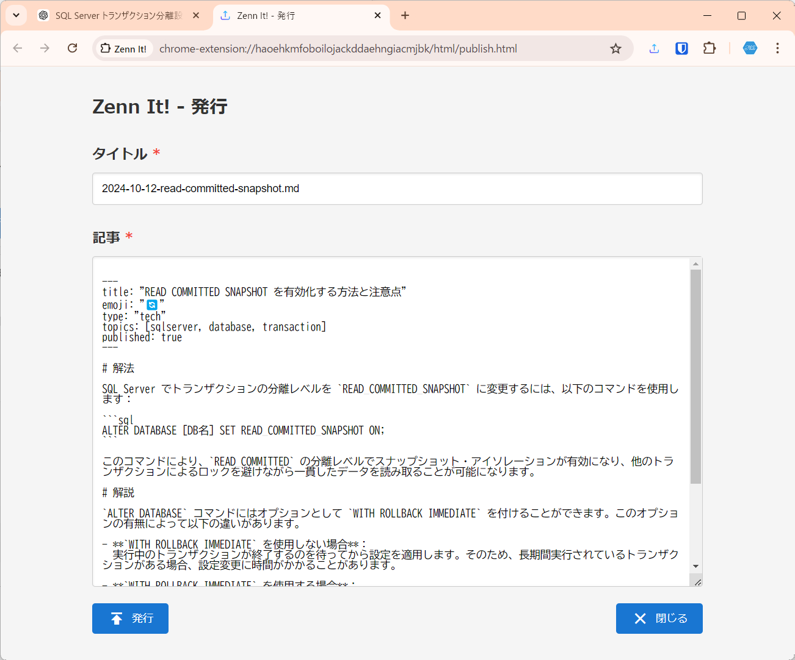

# Zenn It!

Zenn It!は、ChatGPTまたはClaudeとの対話を要約して記事を作成し、ローカルのgit操作なしにZennに公開するChrome拡張です。Edgeでも利用可能です。

日常的にChat AIを利用して調べものをしたり、検討していると、大量の知見がChat AI上にたまっていきます。ただ、あまりにも多くの知見が溜まっていくため、記事にまとめて公開しきれない。そんな悩みを解決してくれるのがZenn It!です。

Zenn It!は、Chat AIとの対話からボタン一つで要約して記事を作成し、作成された記事をブラウザーから直接GitHubにpushすることで、Zennに記事をダイレクトに公開します。

# 導入方法

- [Chrome ウェブストア - Zenn It!](https://chromewebstore.google.com/detail/Zenn+It%21/lhfagcodgjiglflidojjacmmiijhofee)

# サポート環境

- Chat AI
  - ChatGPT Canvas
  - Claude Artifacts
- ブラウザー
  - Google Chrome
  - Microsoft Edge

# 初期設定

まず初めに、Zennの記事を管理しているGitHubリポジトリを設定します。

拡張画面や、拡張機能の右クリックなどからオプション画面を開いてください。

設定画面でGitHubリポジトリのアドレスを設定します。要約用のプロンプトも併せて調整が可能です。

# 使用方法

Chat AIとの対話がひと段落したところで、拡張を開いて「要約」ボタンを押すことで対話を記事に要約します。記事はChatGPTの場合はCanvasへ、Claudeの場合はArtifactsを利用します。

要約には設定画面の定型プロンプトが利用されます。必要であれば個別に調整が可能です。

記事にまとめられたら、各Chat AIでコピーした上で、拡張の「発行」ボタンを押してください。

ファイル名と内容を確認の上、発行してください。同一ファイル名の場合は、確認の上、更新も可能です。

# ドキュメント
 - [全体アーキテクチャ](doc/Architecture.md)