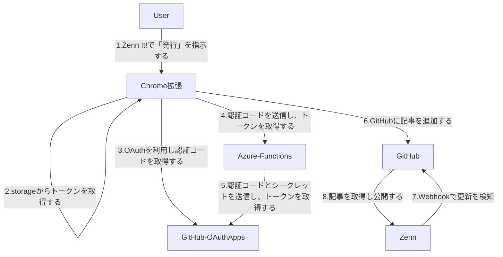

### アーキテクチャ設計書: GitHub OAuthフローの概要

#### 1. 概要

この設計書は、Chrome拡張、GitHub OAuth Apps、Azure Functions、Zennの相互作用によるGitHubトークン取得と記事発行フローを抽象的なレベルで整理します。本システムは、ユーザーが簡単にZennに記事を公開できることを目的としています。

#### 2. 各要素の説明

- **Chrome拡張**: ユーザーインターフェースを提供し、ユーザーが「発行」を指示することで、認証フローを通じてGitHubリソースにアクセスし、記事を追加します。
- **GitHub OAuth Apps**: OAuth 2.0プロトコルを使用して、ユーザーのGitHubアカウントへのアクセスを承認します。Chrome拡張からの認証リクエストに対して、一時的な認証コードを発行します。
- **Azure Functions**: 認証コードをアクセストークンに交換するためのバックエンドサービスとして機能します。Chrome拡張から直接トークンを取得すると、クライアントシークレットを拡張内に置く必要があるため、セキュリティ上のリスクが生じます。このため、Azure Functionsを介してクライアントIDとクライアントシークレットを安全に管理し、アクセストークンを取得します。
- **Zenn**: GitHubのWebhooksを利用して記事の更新を検知し、公開します。

#### 3. コラボレーション図

#### 4. フローの概要

1. **Zenn It!で「発行」を指示する**

   - ユーザーがChrome拡張の「発行」ボタンをクリックすることで、記事の公開フローが開始されます。

2. **storageからトークンを取得する**

   - Chrome拡張はまず、GitHubへのアクセスに必要なトークンがすでに保存されているかを確認するために、`chrome.storage`からトークンを取得します。
   - トークンが存在すれば、それを利用して「6.GitHubに記事を追加する」を実行します。

1) **OAuthを利用し認証コードを取得する**

   - トークンが存在しない場合、Chrome拡張はGitHub OAuth Appsを利用してユーザーに認証を促し、一時的な認証コードを取得します。
   - この認証により、ユーザーが自身のGitHubアカウントへのアクセスを許可します。

2) **認証コードを送信し、トークンを取得する**

   - Chrome拡張は取得した認証コードをAzure Functionsに送信し、GitHub APIにアクセスするためのアクセストークンを取得します。
   - Azure Functionsはセキュリティ上の理由から、GitHubクライアントIDとクライアントシークレットを利用してアクセストークンを安全に取得します。

3) **認証コードとシークレットを送信し、トークンを取得する**

   - Azure FunctionsはGitHub OAuth Appsに認証コードとクライアントシークレットを送信し、アクセストークンを取得します。

4) **GitHubに記事を追加する**

   - Chrome拡張は取得したアクセストークンを用いて、GitHubリポジトリに新しい記事ファイルを追加します。
   - このプロセスにより、ユーザーの記事がGitHub上に保存されます。

5) **Webhookで更新を検知**

   - ZennはGitHubのWebhooksを利用して、リポジトリの更新を検知します。
   - 記事が追加されたことを確認し、更新内容を反映します。

6) **記事を取得し公開する**

   - GitHubから記事の内容を取得し、Zennで公開します。
   - これにより、ユーザーが作成した記事がZennプラットフォーム上で公開され、他のユーザーに閲覧可能となります。

#### 5. 説明

- **ユーザー認証フローの簡略化**: ユーザーはChrome拡張の「発行」ボタンをクリックするだけでGitHubと連携し、記事を公開するプロセスを簡単に行えます。
- **セキュリティの確保**: Azure Functionsを介することで、クライアントシークレットをChrome拡張内に保持せず、セキュリティが強化されています。
- **アクセストークンの有効活用**: トークンはキャッシュされ、GitHub APIの呼び出しに再利用されるため、ユーザー体験が向上します。

#### 6. 今後の拡張

- **トークンの有効期限の管理**: トークンの有効期限を管理し、必要に応じて再取得するフローを追加することで、安定した連携を確保します。
- **バックエンドのスケーラビリティ**: Azure Functionsをスケール可能にして、同時に多くのユーザーが認証を行う場合にも対応できるようにします。
